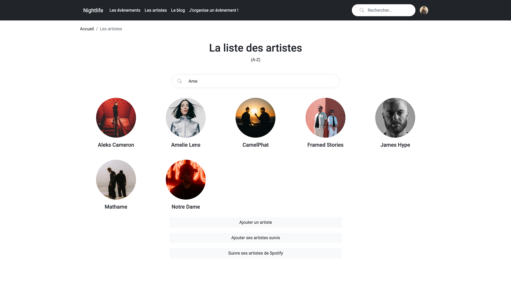
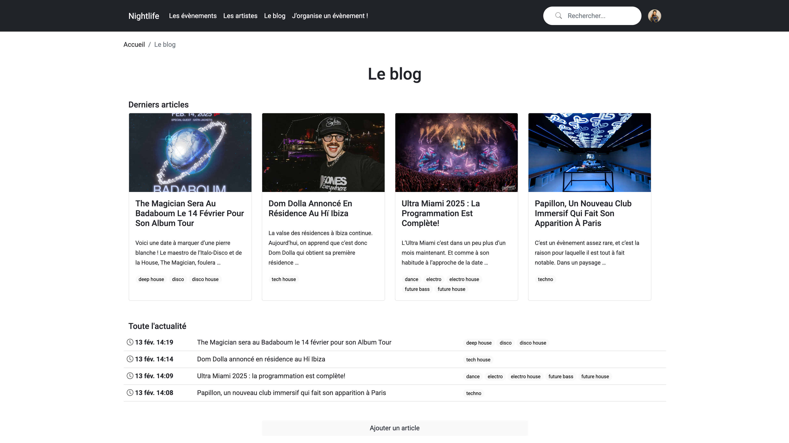
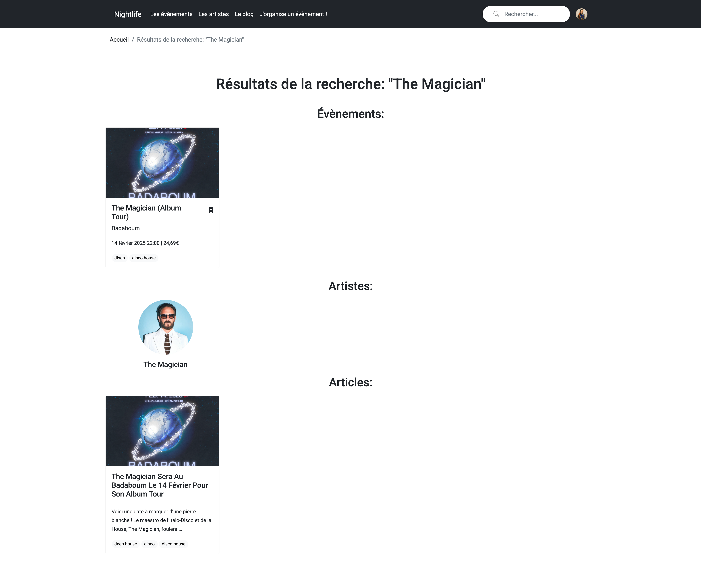

[](https://travis-ci.org/LeMayhem/nightlife)

# Nightlife

## Welcome to Nightlife

Nightlife is a schedule of the week's outings, for people who love electronic music, build by an electronic music lover.
You can find all the popular events and artists, follow them to stay tuned and make friends before going out.

This project aims to use Django framework and Spotify API. This is a WIP, you can follow the building of new features on this repo.

## Installation

1. Clone the repository:

    ```bash
    git clone https://github.com/your-username/nightlife.git
    cd nightlife
    ```

2. Create a virtual environment and activate it:

    ```bash
    python -m venv .env
    source .env/bin/activate  # On Windows, use `venv\Scripts\activate`
    ```

3. Install the dependencies:

    ```bash
    pip install -r requirements.txt
    ```

4. Apply the migrations:

    ```bash
    python manage.py makemigrations
    python manage.py migrate
    ```

5. Create a superuser:

    ```bash
    python manage.py createsuperuser
    ```

6. Run the development server:

    ```bash
    python manage.py runserver
    ```

7. Access the application in your browser at [http://127.0.0.1:8000](http://127.0.0.1:8000).


## Features

### Homepage


You have access to:
- The 4 most populars events from current week (based on "ongoing" button)
- 4 most popular artists (based on "following" button)
- Latest events created
- The top 4 promoters

### Events


Here you can discover and follow events. Promoters can sign up to create their own events to reach new people.
Promoters can ask to feature their events.
Members can discuss on every events to find friends to hangout with.

### Artists




You can check all the events your favorites artists are playing. You can follow them in order to keep you in touch.
With Spotify API, you can do some actions:
- You can massively follow all the artists from your spotify to Nightlife.
- You can massively import all the artists from your Spotify to Nightlife (Admin)
Members can discuss on every artists fan pages to meet other fans.

### Blog




Members can inform themselves with the blog part. Admin can create posts to feature events or artists, to be desplayed on home page.
Members can also discuss on every blog posts.

### Search



- You can search globally from the header's searchbar, which will search on Artists, events and blogposts
- You can filter by using searchbars on Artists, events and blogposts list pages

## WIP:
- Build more interactions between Spotify API and Nightlife (Playlists, etc)
- Add Facebook login
- Add Soundcloud API
- Add notifications system
- More filters on list pages
- Footer


## License

This project is licensed under the MIT License. See the [LICENSE](LICENSE) file for more details.

## Authors

- [Michael LEMAY](https://github.com/lemayhem)